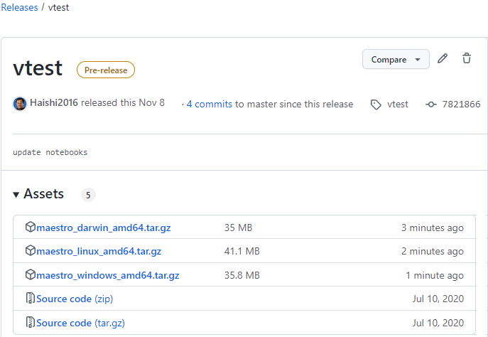

# Building and Releasing Maestro CLI

## Manually create a new CLI release
0. If you are doing this from WSL/Ubuntu, you need to install ```zip```:
   ```bash
   sudo apt-get install zip unzip -y
   ```
1. Build symphony-api and maestro for Windows, Mac and Linux
   ```bash
   # under symphony-api folder
   go mod vendor
   go build -o symphony-api
   GOOS=windows GOARCH=amd64 go build -o symphony-api.exe
   GOOS=darwin GOARCH=amd64 go build -o symphony-api-mac

   # under symphony-docs/cli folder
   go mod vendor
   go build -o maestro
   GOOS=windows GOARCH=amd64 go build -o maestro.exe
   GOOS=darwin GOARCH=amd64 go build -o maestro-mac
   ```
2. In a separate working folder:
   ```bash
   # This example assumes you are under ~/assemble folder, and you've checked out
   # Symphony repos to the ~/projects/go/src/github.com/azure folder
   # To support the original Percept OSS project, you also need to clone the PerceptOSS repo

   # remove previous packages, if any
   rm maestro_linux_amd64.tar.gz
   rm maestro_windows_amd64.tar.gz
   rm maestro_darwin_amd64.tar.gz

   # copy new binary files, configuration files and scripts
   cp ../projects/go/src/github.com/azure/symphony-api/symphony-api .
   cp ../projects/go/src/github.com/azure/symphony-api/symphony-api.exe .
   cp ../projects/go/src/github.com/azure/symphony-api/symphony-api-mac .
   cp ../projects/go/src/github.com/azure/symphony-api/symphony-api-dev.json .
   cp ../projects/go/src/github.com/azure/symphony-docs/cli/maestro .
   cp ../projects/go/src/github.com/azure/symphony-docs/cli/maestro.exe .
   cp ../projects/go/src/github.com/azure/symphony-docs/cli/maestro-mac .
   cp ../projects/go/src/github.com/azure/PerceptOSS/Installer/poss-test-installer.sh .
   
   # Copy over samples
   cp ../projects/go/src/github.com/azure/symphony-docs/samples/samples.json .
   mkdir -p ./k8s
   mkdir -p ./iot-edge
   cp -r ../projects/go/src/github.com/azure/symphony-docs/samples/k8s/hello-world/ ./k8s/
   cp -r ../projects/go/src/github.com/azure/symphony-docs/samples/k8s/staged/ ./k8s/
   cp -r ../projects/go/src/github.com/azure/symphony-docs/samples/iot-edge/simulated-temperature-sensor/ ./iot-edge/

   # package Linux
   tar -czvf maestro_linux_amd64.tar.gz maestro symphony-api symphony-api-dev.json poss-test-installer.sh samples.json k8s iot-edge
   # package Windows
   zip maestro_windows_amd64.zip maestro.exe symphony-api.exe symphony-api-dev.json poss-test-installer.sh samples.json k8s iot-edge
   # package Mac
   rm maestro
   rm symphony-api
   mv maestro-mac maestro
   mv symphony-api-mac symphony-api
   tar -czvf maestro_darwin_amd64.tar.gz maestro symphony-api symphony-api-dev.json poss-test-installer.sh samples.json k8s iot-edge
   ```
3. Edit your release to include the three **.gz** files from the previous step:
   

4. Check ```symphony-docs/cli/install/install.sh``` and ```symphony-docs/cli/install/install.ps1``` to a public repository. Users will be instructed to use scripts from this repo for the one-command experience, for example:
   ```bash
   wget -q https://raw.githubusercontent.com/Haishi2016/Vault818/master/cli/install/install.sh -O - | /bin/bash
   ```

## Appendix
* Build for x64 (on a x64 machine)
  ```bash
  go build -o maestro-x64-<version>
  ```

* Build for ARM64
  ```bash
  CGO_ENABLED=1 GOOS=linux GOARCH=amd64 go build -o maestro-arm64-<version>
  ```

* Build for Windows AMD64
  ```bash
  GOOS=windows GOARCH=amd64 go build -o maestro.exe
  ```

* Build for Mac 
  ```bash
  GOOS=darwin GOARCH=amd64 go build -o maestro-mac
  ```