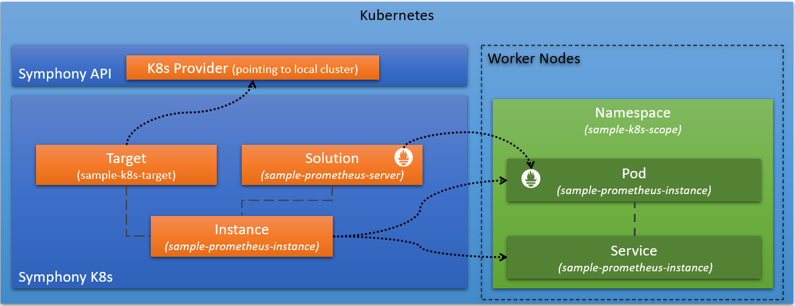

# Symphony Quick Start - Deploying a Prometheus server to a Kubernetes cluster

_(last edit: 6/26/2023)_

Ready to jump into actions right away? This quick start walks you through the steps of setting up a new Symphony control plane on your Kubernetes cluster and deploying a new Symphony solution instance to the cluster.

> **NOTE**: The following steps are tested under a Ubuntu 20.04.4 TLS WSL system on Windows 11. However, they should work for Linux, Windows, and MacOS systems as well.



## OPTION 1: Using Maestro
Once you have maestro installed (see instructions [here](./quick_start.md)), you can launch this sample with:
```bash
maestro samples run hello-k8s
```

Maestro displays the service public IP that you can open with a browser. If the IP doesn't show up, repeat the above command (it takes a while for a public IP to be provisioned).

> **NOTE**: If you are using Kubernetes distributions that don't support assigning public IPs, you can set up port forwarding to access the deployed Prometheus server.

To clean up, use:
```
maestro samples remove hello-k8s
```

## OPTION 2: Using Helm and Kubectl

### 0. Prerequisites

* [Helm 3](https://helm.sh/)
* [kubectl](https://kubernetes.io/docs/reference/kubectl/kubectl/) is configured with the Kubernetes cluster you want to use as the default context

### 1. Deploy Symphony using Helm

The easiest way to install Symphony is to use Helm:
```bash
helm install symphony oci://possprod.azurecr.io/helm/symphony --version 0.44.6
```

Or, if you already have the ```symphony``` repository cloned:
```bash
cd k8s/helm
helm install symphony ./symphony
```
### 2. Register the current cluster as a Symphony Target
Create a new YAML file that describes a Symphony Target. This target definition registers the current Kubernetes cluster itself as a deployment target (note the ```inCluster=true``` property, for more information on Kubernetes provider, please see [here](../providers/k8s_provider.md).

> **NOTE**: You can get a sample of this file under ```symphony-docs/samples/k8s/hello-world/target.yaml```:

```yaml
apiVersion: fabric.symphony/v1
kind: Target
metadata:
  name: sample-k8s-target        
spec:  
  forceRedeploy: true
  topologies:
  - bindings:
    - role: instance
      provider: providers.target.k8s
      config:
        inCluster: "true"   
```
> **NOTE**: The above sample doesn't deploy a **Symphony Agent**, which is optional.

### 3. Create the Symphony Solution
The following YAMl file describes a Symphony Solution with a single Redis server component.

> **NOTE**: You can get a sample of this file under ```symphony-docs/samples/k8s/hello-world/solution.yaml```:

```yaml
apiVersion: solution.symphony/v1
kind: Solution
metadata: 
  name: sample-prometheus-server
spec:  
  metadata:
    deployment.replicas: "#1"
    service.ports: "[{\"name\":\"port9090\",\"port\": 9090}]"
    service.type: "LoadBalancer"
  components:
  - name: sample-prometheus-server
    type: container
    properties:
      container.ports: "[{\"containerPort\":9090,\"protocol\":\"TCP\"}]"
      container.imagePullPolicy: "Always"
      container.resources: "{\"requests\":{\"cpu\":\"100m\",\"memory\":\"100Mi\"}}"        
      container.image: "prom/prometheus"
```
> **NOTE**: This solution uses the default deployment strategy, which is to deploy all component containers in the solution into a same pod. See [here](../providers/k8s_provider.md) for details on other possible deployment strategies.
### 4. Create the Symphony Solution Instance
A Symphony Solution Instance maps a Symphony Solution to one or multiple Targets. The following artifacts maps the ```sample-prometheus-server``` soltuion to the ```sample-k8s-target ``` target above:
> **NOTE**: You can get a sample of this file under ```symphony-docs/samples/k8s/hello-world/instance.yaml```:
```yaml
apiVersion: solution.symphony/v1
kind: Instance
metadata:
  name: sample-prometheus-instance
spec:
  scope: sample-k8s-scope
  solution: sample-prometheus-server
  target: 
    name: sample-k8s-target  
```
## 5. Create all objects
```bash
kubectl create -f target.yaml
kubectl create -f solution.yaml
kubectl create -f instance.yaml
```
## 6. Verification
Examine all Symphony objects have created:
```bash
kubectl get targets
kubectl get solutions
kubectl get instances
```
You can observe the deployment status of the instance:
```bash
NAME                         STATUS      TARGETS   DEPLOYED
sample-prometheus-instance   OK          1         1
```
Use ```kubectl``` to examin pods and services:
```bash
kubectl get all -n sample-k8s-scope
```
You should observe that a ```sample-prometheus-instance``` pod and a ```sample-prometheus-instance``` service have been created. You can get the public IP of the Prometheus service and use a browser to navigate to the Prometheus portal (port 9090).

## 7. Clean up Symphony objects

To delete all Symphony objects:
```bash
kubectl delete instance sample-prometheus-instance
kubectl delete solution sample-prometheus-server
kubectl delete target sample-k8s-target  
kubectl delete ns sample-k8s-scope #Symphony doesn't remove namespaces
```
## 8. To remove Symphony control plane (optional)
```bash
helm delete symphony
```

## Appendix

If you need to install the Helm chart from a private ACR like ```symphonyk8s.azurecr.io```, you need to log in first:
```bash
# login as necessary. Note once the repo is turned public no authentication is needed
export HELM_EXPERIMENTAL_OCI=1
USER_NAME="00000000-0000-0000-0000-000000000000"
PASSWORD=$(az acr login --name symphonyk8s --expose-token --output tsv --query accessToken)
helm registry login symphonyk8s.azurecr.io   --username $USER_NAME --password $PASSWORD

# install using Helm chart
helm install symphony oci://symphonyk8s.azurecr.io/helm/symphony --version 0.40.8
```